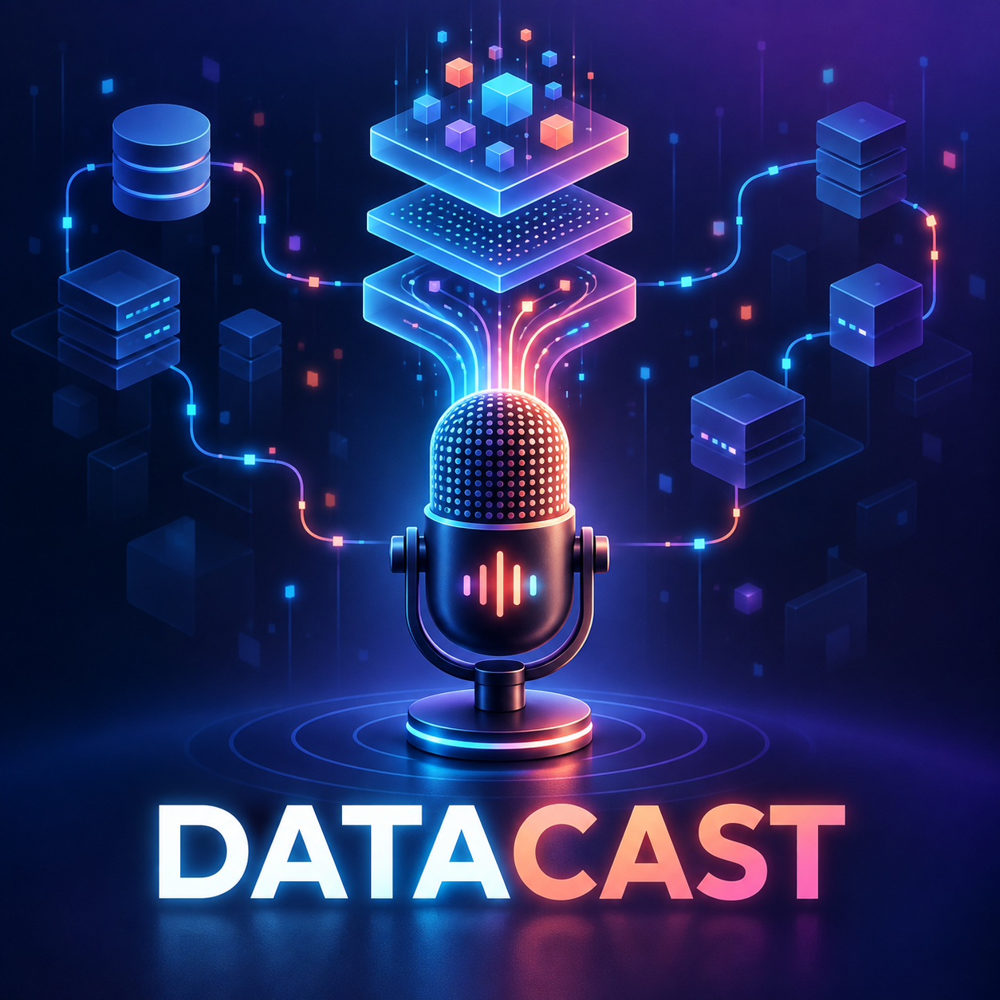

  

# DataCast

Podcast sobre dados e tecnologia criado para o desafio **Criando um Podcast com IAs Generativas**, da DIO.

## Episódio

### Primeiros passos com Databricks

Uma introdução ao Databricks, ao conceito de lakehouse e à arquitetura medalhão.

🎧 [Ouvir o episódio](./output/podcast_editado.MP3)

## Como foi produzido

- nome e roteiro estruturados com auxílio de IA generativa;
- informações técnicas conferidas na documentação oficial do Databricks;
- capa criada por um modelo de geração de imagens;
- narração produzida por síntese de voz;
- conteúdo revisado para usar linguagem acessível a iniciantes.

## Estrutura do projeto

- `assets/cover.png`: capa do podcast;
- `src/roteiro.md`: roteiro final do episódio;
- `src/prompts/chatgpt.md`: prompts de título e roteiro;
- `src/prompts/midjourney.md`: prompt utilizado para criar a capa;
- `src/prompts/narracao.md`: instruções da síntese de voz;
- `output/synthesized_audio.mp3`: narração sintetizada;
- `output/podcast_editado.MP3`: episódio final entregue.

## Tecnologias utilizadas

- IA generativa de texto para planejamento e roteiro;
- IA generativa de imagem para a capa;
- síntese de voz para a narração;
- Git e GitHub para versionamento e publicação.

## Referências

- [O que é um data lakehouse?](https://docs.databricks.com/aws/en/lakehouse/)
- [Arquitetura medalhão](https://docs.databricks.com/aws/en/lakehouse/medallion)

## Aviso

Este conteúdo é introdutório e foi produzido com apoio de inteligência artificial, seguido de curadoria humana.

---

Projeto desenvolvido para fins educacionais durante a formação da DIO.
